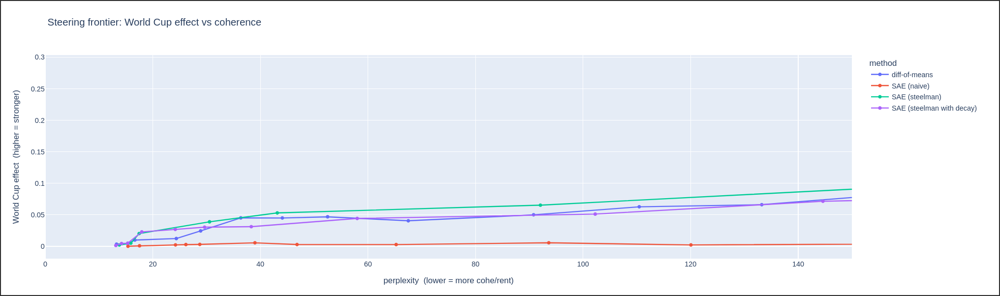

# Comparing Steering Methods: Difference-of-Means vs Naive SAE vs Steelman SAE

A small case study steering **GPT-2 small** toward the concept of the **World Cup**, comparing a cheap supervised baseline against sparse-autoencoder (SAE) steering, on a shared *effect vs coherence* frontier.

📝 **Blog write-up:** [read the full post here](ADD_YOUR_BLOG_URL)

## The question

There is an ongoing debate about whether SAEs are actually useful for **steering** language models:

- **Skeptics** (Kantamneni et al., [2502.16681](https://arxiv.org/abs/2502.16681)) show a naive SAE loses to a simple difference-of-means baseline.
- **Defenders** ([2505.20063](https://arxiv.org/abs/2505.20063), [2510.01246](https://arxiv.org/abs/2510.01246)) argue the SAEs were just steered badly, and that a well-applied ("steelman") SAE competes with the baseline.

This project puts both stances in a single notebook and referees them on the same testbed.

## Methods compared

All four inject at `blocks.6.hook_resid_pre`, evaluated on 25 held-out neutral prompts:

| Method | What it is |
|---|---|
| **Difference-of-means** | Supervised direction: `mean(world-cup acts) − mean(neutral acts)` |
| **Naive SAE** | Add the decoder direction `W_dec[7392]` |
| **Steelman SAE (constant)** | Encode, clamp latent 7392 to a target, decode + error term |
| **Steelman SAE (decay)** | Same, but the clamp target decays across generated token positions |

Two metrics form the axes:
- **Effect** — density of World Cup keywords in the output.
- **Coherence** — perplexity of the output under the clean model (lower = more coherent).

## Result



- The **naive SAE loses** everywhere.
- **Difference-of-means** ties the **steelman SAE (both variants)** across the coherent range.
- The constant steelman only pulls ahead at high perplexity, where the text is already degrading.

**Takeaway:** when you already know the direction you want to steer, a cheap supervised vector matches a much more involved SAE. This lines up with the guidance to *use SAEs to discover unknown concepts, not to act on known ones* ([Wu et al., 2506.23845](https://arxiv.org/abs/2506.23845)).

See the blog post for the full narrative, limitations, and example generations.

## Running it

The notebook was written for **Kaggle** (T4 GPU), using:

- [`transformer_lens`](https://github.com/TransformerLensOrg/TransformerLens)
- [`sae_lens`](https://github.com/jbloomAus/SAELens) (SAE release `gpt2-small-res-jb`, latent 7392)

```bash
pip install transformer_lens sae-lens
```

Open `steering_methods.ipynb` and run top to bottom on a GPU runtime.

## Limitations

Small evaluation set (25 prompts, no error bars), a keyword-based effect metric that rewards repetition, and a single model / concept / latent. This is a case study, not a general benchmark. Details in the blog.
